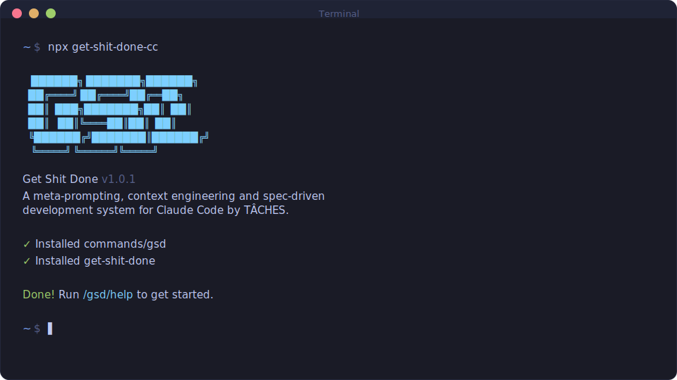

<div align="center">

# GET SHIT DONE (Cursor Edition)

**A light-weight and powerful meta-prompting, context engineering and spec-driven development system optimized for Cursor IDE.**

> **Note:** This is a Cursor-focused fork of [get-shit-done](https://github.com/glittercowboy/get-shit-done) by TÂCHES, adapted with full Cursor IDE support.

[](https://www.npmjs.com/package/get-shit-done-cursor)
[](https://www.npmjs.com/package/get-shit-done-cursor)
[](LICENSE)
[](https://github.com/heyaryansingh/get-shit-done-cursor)

<br>

```bash
npx get-shit-done-cursor --cursor --local
```

**Works on Mac, Windows, and Linux.**

**✨ Now fully supported for Cursor IDE!**

<br>



<br>

*"If you know clearly what you want, this WILL build it for you. No bs."*

*"I've done SpecKit, OpenSpec and Taskmaster — this has produced the best results for me."*

*"By far the most powerful addition to my Claude Code. Nothing over-engineered. Literally just gets shit done."*

<br>

**Trusted by engineers at Amazon, Google, Shopify, and Webflow.**

[Why I Built This](#why-i-built-this) · [How It Works](#how-it-works) · [Commands](#commands) · [Why It Works](#why-it-works)

</div>

---

## Why I Built This

I'm a solo developer. I don't write code — AI does.

Other spec-driven development tools exist; BMAD, Speckit... But they all seem to make things way more complicated than they need to be (sprint ceremonies, story points, stakeholder syncs, retrospectives, Jira workflows) or lack real big picture understanding of what you're building. I'm not a 50-person software company. I don't want to play enterprise theater. I'm just a creative person trying to build great things that work.

So I built GSD. The complexity is in the system, not in your workflow. Behind the scenes: context engineering, XML prompt formatting, subagent orchestration, state management. What you see: a few commands that just work.

The system gives Claude everything it needs to do the work *and* verify it. I trust the workflow. It just does a good job.

That's what this is. No enterprise roleplay bullshit. Just an incredibly effective system for building cool stuff consistently using AI-powered IDEs like Claude Code.

— **TÂCHES**

---

Vibecoding has a bad reputation. You describe what you want, AI generates code, and you get inconsistent garbage that falls apart at scale.

GSD fixes that. It's the context engineering layer that makes AI-powered development reliable. Describe your idea, let the system extract everything it needs to know, and let Cursor or Claude Code get to work.

---

## Who This Is For

People who want to describe what they want and have it built correctly — without pretending they're running a 50-person engineering org.

**Perfect for:**
- Cursor users who want structured, reliable AI-assisted development
- Solo developers building MVPs and side projects
- Teams using AI coding assistants who need better context management
- Anyone tired of inconsistent AI-generated code

---

## Getting Started

### Quick Install for Cursor

**Install in any Cursor project:**
```bash
npx get-shit-done-cursor --cursor --local
```

Or use the shorter alias:
```bash
npx gsd-cursor --cursor --local
```

**After installation:**
1. **Restart Cursor** to reload slash commands
2. Open the Cursor chat (Ctrl+L or Cmd+L)
3. Type `/gsd:help` to verify it's working

**For global installation (available in all projects):**
```bash
npx get-shit-done-cursor --cursor --global
```

This installs to `~/.cursor/` and makes GSD available in all your Cursor projects without reinstalling.

**Alternative: Install from GitHub:**
```bash
npx github:heyaryansingh/get-shit-done-cursor --cursor --local
```

### Quick Install for Claude Code

> **Note:** For Claude Code, use the original package: `npx get-shit-done-cc`

This Cursor edition focuses on Cursor IDE. For Claude Code support, please use the [original repository](https://github.com/glittercowboy/get-shit-done).

That's it. Verify with `/gsd:help` inside your Cursor or Claude Code interface.

<details>
<summary><strong>Non-interactive Install (Docker, CI, Scripts)</strong></summary>

**Claude Code:**
```bash
# Use original package for Claude Code
npx get-shit-done-cc --global   # Install to ~/.claude/
npx get-shit-done-cc --local    # Install to ./.claude/
```

**Cursor IDE:**
```bash
npx get-shit-done-cursor --cursor --global   # Install to ~/.cursor/
npx get-shit-done-cursor --cursor --local    # Install to ./.cursor/
```

Use `--global` (`-g`) or `--local` (`-l`) to skip the interactive prompt.

</details>

<details>
<summary><strong>Development Installation</strong></summary>

Clone the repository and run the installer locally:

```bash
git clone https://github.com/glittercowboy/get-shit-done.git
cd get-shit-done
node bin/install.js --local
```

Installs to `./.claude/` for testing modifications before contributing.

</details>

### Cursor Setup

**No additional configuration needed!** Cursor has permissive defaults that work well with GSD out of the box.

If you encounter permission prompts, you can configure them in your project's `.cursor/settings.json`:

```json
{
  "permissions": {
    "allow": [
      "Bash(date:*)",
      "Bash(echo:*)",
      "Bash(cat:*)",
      "Bash(ls:*)",
      "Bash(mkdir:*)",
      "Bash(wc:*)",
      "Bash(head:*)",
      "Bash(tail:*)",
      "Bash(sort:*)",
      "Bash(grep:*)",
      "Bash(tr:*)",
      "Bash(git add:*)",
      "Bash(git commit:*)",
      "Bash(git status:*)",
      "Bash(git log:*)",
      "Bash(git diff:*)",
      "Bash(git tag:*)"
    ]
  }
}
```

### Claude Code Setup

**For Claude Code:**
```bash
claude --dangerously-skip-permissions
```

> [!TIP]
> GSD is designed for frictionless automation — stopping to approve `date` and `git commit` 50 times defeats the purpose.

<details>
<summary><strong>Alternative: Granular Permissions (Claude Code)</strong></summary>

If you prefer not to use that flag, add this to your project's `.claude/settings.json`:

```json
{
  "permissions": {
    "allow": [
      "Bash(date:*)",
      "Bash(echo:*)",
      "Bash(cat:*)",
      "Bash(ls:*)",
      "Bash(mkdir:*)",
      "Bash(wc:*)",
      "Bash(head:*)",
      "Bash(tail:*)",
      "Bash(sort:*)",
      "Bash(grep:*)",
      "Bash(tr:*)",
      "Bash(git add:*)",
      "Bash(git commit:*)",
      "Bash(git status:*)",
      "Bash(git log:*)",
      "Bash(git diff:*)",
      "Bash(git tag:*)"
    ]
  }
}
```

</details>

---

## How It Works

GSD works seamlessly in Cursor. Install once per project, then use slash commands in the Cursor chat.

### Quick Start Workflow

**1. Start with an idea**

In Cursor chat, type:
```
/gsd:new-project
```

The system asks questions about your goals, constraints, tech preferences, and edge cases. Keeps asking until everything is captured. Creates **PROJECT.md** in `.planning/`.

**2. Create roadmap**

In Cursor chat:
```
/gsd:create-roadmap
```

Produces:
- **ROADMAP.md** — Phases from start to finish
- **STATE.md** — Living memory that persists across sessions

**3. Plan and execute phases**

```
/gsd:plan-phase 1      # System creates atomic task plans
/gsd:execute-plan .planning/phases/01-foundation/01-01-PLAN.md
```

Each phase breaks into 2-3 atomic tasks. Each task runs in a fresh context — 200k tokens purely for implementation, zero degradation.

**For multi-plan phases:**
```
/gsd:execute-phase 1   # Run all plans in parallel, "walk away" execution
```

Use `/gsd:execute-plan` for interactive single-plan execution with checkpoints. Use `/gsd:execute-phase` when you have multiple plans and want parallel "walk away" automation.

**4. Ship and iterate**

```
/gsd:complete-milestone   # Archive v1, prep for v2
/gsd:add-phase            # Append new work
/gsd:insert-phase 2       # Slip urgent work between phases
```

Ship your MVP in a day. Add features. Insert hotfixes. The system stays modular — you're never stuck.

---

## Using GSD in Your Cursor Projects

### For New Projects

1. **Create your project folder:**
   ```bash
   mkdir my-awesome-project
   cd my-awesome-project
   ```

2. **Install GSD:**
   ```bash
   npx get-shit-done-cursor --cursor --local
   ```

3. **Restart Cursor** and open your project

4. **Start using GSD commands:**
   - `/gsd:new-project` - Initialize your project
   - `/gsd:create-roadmap` - Create your development roadmap
   - `/gsd:plan-phase 1` - Plan the first phase
   - `/gsd:execute-plan` - Execute your plans

### For Existing Projects

1. **Navigate to your project:**
   ```bash
   cd your-existing-project
   ```

2. **Install GSD:**
   ```bash
   npx get-shit-done-cursor --cursor --local
   ```

3. **Restart Cursor** and open your project

4. **Map your existing codebase:**
   In Cursor chat, type:
   ```
   /gsd:map-codebase
   ```
   
   This analyzes your codebase and creates `.planning/codebase/` with 7 documents:
   
   | Document | Purpose |
   |----------|---------|
   | `STACK.md` | Languages, frameworks, dependencies |
   | `ARCHITECTURE.md` | Patterns, layers, data flow |
   | `STRUCTURE.md` | Directory layout, where things live |
   | `CONVENTIONS.md` | Code style, naming patterns |
   | `TESTING.md` | Test framework, patterns |
   | `INTEGRATIONS.md` | External services, APIs |
   | `CONCERNS.md` | Tech debt, known issues, fragile areas |

5. **Initialize project:**
   ```
   /gsd:new-project
   ```
   
   The system now knows your codebase. Questions focus on what you're adding/changing.

6. **Continue as normal:**
   - `/gsd:create-roadmap` - Create roadmap
   - `/gsd:plan-phase 1` - Plan phases
   - `/gsd:execute-plan` - Execute plans
   
   The codebase docs load automatically during planning. The AI knows your patterns, conventions, and where to put things.

---

## Why It Works

### Context Engineering

Cursor and Claude Code are incredibly powerful *if* you give them the context they need. Most people don't.

GSD handles it for you:

| File | What it does |
|------|--------------|
| `PROJECT.md` | Project vision, always loaded |
| `ROADMAP.md` | Where you're going, what's done |
| `STATE.md` | Decisions, blockers, position — memory across sessions |
| `PLAN.md` | Atomic task with XML structure, verification steps |
| `SUMMARY.md` | What happened, what changed, committed to history |
| `ISSUES.md` | Deferred enhancements tracked across sessions |
| `todos/` | Captured ideas and tasks for later work |

Size limits based on where AI quality degrades. Stay under, get consistent excellence.

### XML Prompt Formatting

Every plan is structured XML optimized for Claude:

```xml
<task type="auto">
  <name>Create login endpoint</name>
  <files>src/app/api/auth/login/route.ts</files>
  <action>
    Use jose for JWT (not jsonwebtoken - CommonJS issues).
    Validate credentials against users table.
    Return httpOnly cookie on success.
  </action>
  <verify>curl -X POST localhost:3000/api/auth/login returns 200 + Set-Cookie</verify>
  <done>Valid credentials return cookie, invalid return 401</done>
</task>
```

Precise instructions. No guessing. Verification built in.

### Subagent Execution

As AI fills its context window, quality degrades. You've seen it: *"Due to context limits, I'll be more concise now."* That "concision" is code for cutting corners.

GSD prevents this. Each plan is maximum 3 tasks. Each plan runs in a fresh context — 200k tokens purely for implementation, zero accumulated garbage.

| Task | Context | Quality |
|------|---------|---------|
| Task 1 | Fresh | ✅ Full |
| Task 2 | Fresh | ✅ Full |
| Task 3 | Fresh | ✅ Full |

No degradation. Walk away, come back to completed work.

### Atomic Git Commits

Each task gets its own commit immediately after completion:

```bash
abc123f docs(08-02): complete user registration plan
def456g feat(08-02): add email confirmation flow
hij789k feat(08-02): implement password hashing
lmn012o feat(08-02): create registration endpoint
```

> [!NOTE]
> **Benefits:** Git bisect finds exact failing task. Each task independently revertable. Clear history for AI in future sessions. Better observability in AI-automated workflow.

Every commit is surgical, traceable, and meaningful.

### Modular by Design

- Add phases to current milestone
- Insert urgent work between phases
- Complete milestones and start fresh
- Adjust plans without rebuilding everything

You're never locked in. The system adapts.

---

## Commands

| Command | What it does |
|---------|--------------|
| `/gsd:new-project` | Extract your idea through questions, create PROJECT.md |
| `/gsd:create-roadmap` | Create roadmap and state tracking |
| `/gsd:map-codebase` | Map existing codebase for brownfield projects |
| `/gsd:plan-phase [N]` | Generate task plans for phase |
| `/gsd:execute-plan` | Run single plan via subagent |
| `/gsd:execute-phase <N>` | Execute all plans in phase N with parallel agents |
| `/gsd:status [--wait]` | Check background agent status from parallel execution |
| `/gsd:progress` | Where am I? What's next? |
| `/gsd:verify-work [N]` | User acceptance test of phase or plan ¹ |
| `/gsd:plan-fix [plan]` | Plan fixes for UAT issues from verify-work |
| `/gsd:complete-milestone` | Ship it, prep next version |
| `/gsd:discuss-milestone` | Gather context for next milestone |
| `/gsd:new-milestone [name]` | Create new milestone with phases |
| `/gsd:add-phase` | Append phase to roadmap |
| `/gsd:insert-phase [N]` | Insert urgent work |
| `/gsd:remove-phase [N]` | Remove future phase, renumber subsequent |
| `/gsd:discuss-phase [N]` | Gather context before planning |
| `/gsd:research-phase [N]` | Deep ecosystem research for niche domains |
| `/gsd:list-phase-assumptions [N]` | See what Claude thinks before you correct it |
| `/gsd:pause-work` | Create handoff file when stopping mid-phase |
| `/gsd:resume-work` | Restore from last session |
| `/gsd:resume-task [id]` | Resume interrupted subagent execution |
| `/gsd:consider-issues` | Review deferred issues, close resolved, identify urgent |
| `/gsd:add-todo [desc]` | Capture idea or task from conversation for later |
| `/gsd:check-todos [area]` | List pending todos, select one to work on |
| `/gsd:debug [desc]` | Systematic debugging with persistent state across `/clear` |
| `/gsd:help` | Show all commands and usage guide |

<sup>¹ Contributed by reddit user OracleGreyBeard</sup>

---

## Troubleshooting

**Commands not found after install?**
- **Restart Cursor** - This is required! Close and reopen Cursor after installation
- Verify files exist: `./.cursor/commands/gsd/` (local) or `~/.cursor/commands/gsd/` (global)
- Make sure you're in the project directory where you ran the install command

**Commands not working as expected?**
- Run `/gsd:help` to verify installation
- Re-run `npx get-shit-done-cursor --cursor --local` to reinstall

**Updating to the latest version?**
```bash
npx get-shit-done-cursor@latest --cursor --local
```

**Using Docker or containerized environments?**

If file reads fail with tilde paths, set the appropriate config directory before installing:

**Claude Code:**
```bash
# Use original package for Claude Code
CLAUDE_CONFIG_DIR=/home/youruser/.claude npx get-shit-done-cc --global
```

**Cursor:**
```bash
CURSOR_CONFIG_DIR=/home/youruser/.cursor npx get-shit-done-cursor --cursor --global
```

This ensures absolute paths are used instead of `~` which may not expand correctly in containers.

---

## Star History

<a href="https://star-history.com/#heyaryansingh/get-shit-done-cursor&Date">
 <picture>
   <source media="(prefers-color-scheme: dark)" srcset="https://api.star-history.com/svg?repos=heyaryansingh/get-shit-done-cursor&type=Date&theme=dark" />
   <source media="(prefers-color-scheme: light)" srcset="https://api.star-history.com/svg?repos=heyaryansingh/get-shit-done-cursor&type=Date" />
   
 </picture>
</a>

---

## License

MIT License. See [LICENSE](LICENSE) for details.

---

<div align="center">

**Cursor is powerful. GSD makes it reliable.**

</div>

---

## Credits

This is a Cursor-focused fork of [get-shit-done](https://github.com/glittercowboy/get-shit-done) by [TÂCHES](https://github.com/glittercowboy). 

Original work by TÂCHES. Cursor adaptation and enhancements by [heyaryansingh](https://github.com/heyaryansingh).
